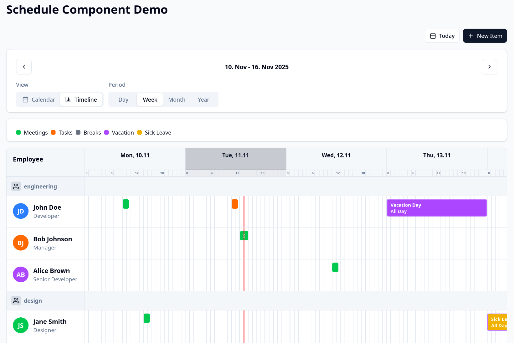
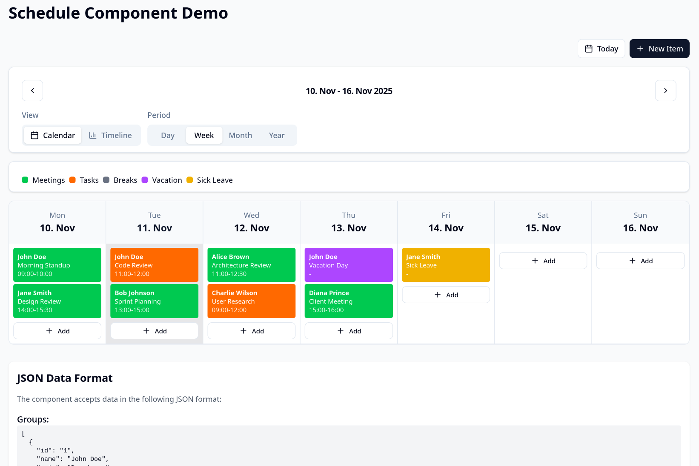
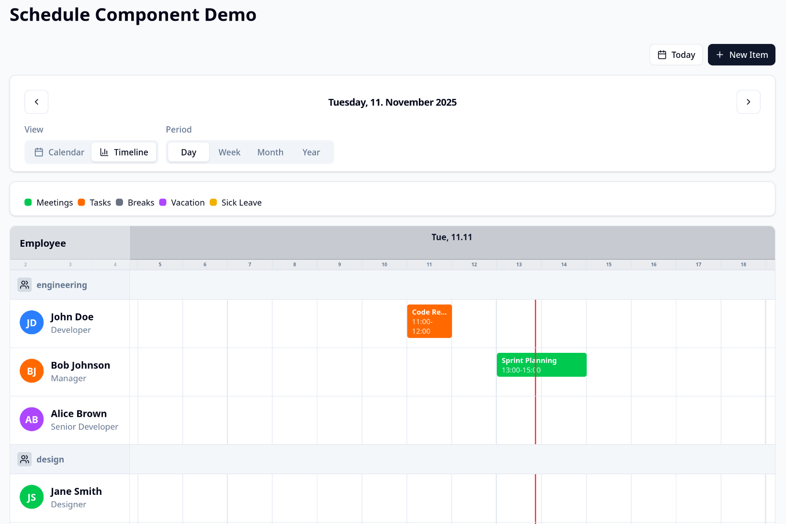
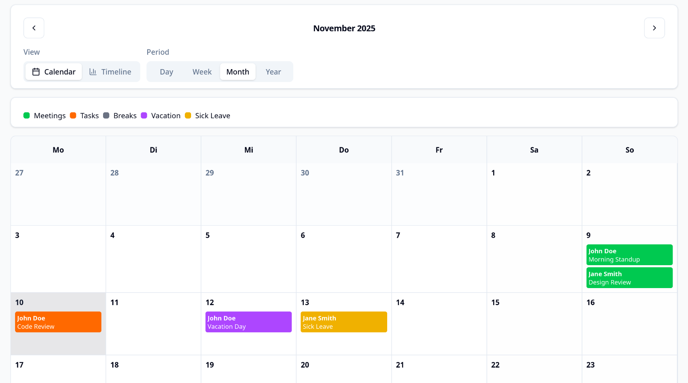

# React Schedule Timeline

[](https://www.gnu.org/licenses/agpl-3.0.html)  
[](https://www.typescriptlang.org/)

A powerful, customizable React component for displaying schedules in both calendar and timeline views. Perfect for project management, employee scheduling, resource allocation, and any time-based data visualization needs.

## ✨ Features

- 📅 **Calendar View**: Traditional calendar layout with day/week/month/year views
- 📊 **Timeline View**: Timeline visualization for project management and scheduling
- 🎨 **Fully Customizable**: Configure colors, types, and styling with ease
- 📱 **Responsive Design**: Mobile-friendly and responsive across all devices
- 🔧 **TypeScript Support**: Full TypeScript support with comprehensive type definitions
- 🎯 **JSON Data**: Simple JSON data format for easy integration
- ⚡ **Lightweight**: Minimal dependencies and optimized performance
- 🖱️ **Drag & Drop**: Intuitive drag-and-drop functionality for item management
- 🎛️ **Flexible Configuration**: Extensive customization options

## ⚖️ Licensing (AGPL for OSS, Commercial for Business Use)

**@jonaskenke/react-timeline-scheduler** is dual-licensed:

- **AGPL v3** (Open Source) for personal, educational, academic, and non-commercial projects
- **Commercial License** for SaaS, closed-source, enterprise, or business use

For commercial licensing, please join the [Waitlist](https://form.kreativhub.tech/s/cmht3avol000gmy01q6fnbji9) or [Contact us](jonas.kenke@gmail.com).

See [LICENSE](LICENSE) and [COMMERCIAL-LICENSE.md](COMMERCIAL-LICENSE.md) for details.

---

## 📦 Installation

```
npm install @jonaskenke/react-timeline-scheduler
```

---

## 🚀 Quick Start

```
import React from "react";
import { ScheduleComponent } from "@jonaskenke/react-timeline-scheduler";

const groups = [
  { id: "1", name: "John Doe", role: "Developer" },
  { id: "2", name: "Jane Smith", role: "Designer" },
];

const scheduleItems = [
  {
    id: "1",
    employeeId: "1",
    title: "Morning Standup",
    date: "2025-11-09",
    startTime: "09:00",
    endTime: "10:00",
    type: "meeting",
  },
  {
    id: "2",
    employeeId: "2",
    title: "Design Review",
    date: "2025-11-09",
    startTime: "14:00",
    endTime: "15:30",
    type: "task",
  },
];

function App() {
  return (
    <ScheduleComponent
      items={scheduleItems}
      groups={groups}
      onItemClick={(item) => console.log("Clicked:", item)}
    />
  );
}

export default App;
```

---

## � Demo

A demo can be found here: https://timeline.kreativhub.tech

---

## 📷 Screenshots

Below are a few screenshots demonstrating the component in different views and responsive sizes.

<p align="center">
  
</p>

**Figure 1.** Timeline view showing grouped resources and item bars.

<p align="center">
  
</p>

**Figure 2.** Calendar view with color-coded item types.

<p align="center">
  
  
</p>

---

---

## �📋 Table of Contents

- [Features](#-features)
- [Installation](#-installation)
- [Quick Start](#-quick-start)
- [Demo](#-demo)
- [Data Format](#-data-format)
- [Props API](#-props-api)
- [Customization](#-customization)
- [Views](#-views)
- [Event Handlers](#-event-handlers)
- [Dependencies](#-dependencies)
- [Browser Support](#-browser-support)
- [Contributing](#-contributing)
- [License](#-license)
- [Commercial License & Waitlist](#-commercial-license--waitlist)

---

## 📊 Data Format

### Groups (Resources)

Groups represent the entities that own the schedule items (employees, resources, projects, etc.).

```
interface BaseGroup {
  id: string; // Unique identifier
  name: string; // Display name
  role?: string; // Optional role/title
  color?: string; // Optional custom color (hex or CSS class)
  avatar?: string; // Optional avatar URL
  // ...any additional custom fields
}
```

### Schedule Items

Schedule items represent the actual events, tasks, or appointments on the timeline.

```
interface BaseScheduleItem {
  id: string; // Unique identifier
  employeeId: string; // References group.id
  title: string; // Item title
  date: string; // ISO date string (YYYY-MM-DD)
  startTime?: string; // HH:MM format (optional for all-day)
  endTime?: string; // HH:MM format (optional for all-day)
  allDay?: boolean; // All-day event flag
  type?: string; // Category type for styling
  color?: string; // Custom color override
  notes?: string; // Additional notes
  // ...any additional custom fields
}
```

---

## 🔧 Props API

| Prop           | Type                                             | Default      | Description                              |
| -------------- | ------------------------------------------------ | ------------ | ---------------------------------------- |
| `items`        | `BaseScheduleItem[]`                             | -            | **Required.** Array of schedule items    |
| `groups`       | `BaseGroup[]`                                    | -            | **Required.** Array of groups/resources  |
| `viewMode`     | `'day' \| 'week' \| 'month' \| 'year'`           | `'week'`     | Initial calendar view mode               |
| `displayMode`  | `'calendar' \| 'timeline'`                       | `'calendar'` | Initial display mode                     |
| `currentDate`  | `Date`                                           | `new Date()` | Initial date to display                  |
| `itemTypes`    | `Record<string, {label: string, color: string}>` | -            | Configuration for item types             |
| `onItemClick`  | `(item) => void`                                 | -            | Callback when item is clicked            |
| `onItemCreate` | `(data) => void`                                 | -            | Callback when create action is triggered |
| `onItemUpdate` | `(id, data) => void`                             | -            | Callback when update action is triggered |
| `canCreate`    | `boolean`                                        | `true`       | Enable create functionality              |
| `canEdit`      | `boolean`                                        | `true`       | Enable edit functionality                |
| `showControls` | `boolean`                                        | `true`       | Show navigation controls                 |
| `showLegend`   | `boolean`                                        | `true`       | Show item type legend                    |
| `locale`       | `string`                                         | `'en'`       | Date locale for formatting               |
| `className`    | `string`                                         | -            | Additional CSS classes                   |

---

## 🎨 Customization

### Item Types Configuration

Define custom item types with colors and labels for better categorization:

```
const itemTypes = {
  meeting: {
    label: "Meeting",
    color: "bg-blue-500",
  },
  task: {
    label: "Task",
    color: "bg-green-500",
  },
  break: {
    label: "Break",
    color: "bg-gray-500",
  },
  vacation: {
    label: "Vacation",
    color: "bg-yellow-500",
  },
};

<ScheduleComponent
  items={scheduleItems}
  groups={groups}
  itemTypes={itemTypes}
/>;
```

### Custom Styling

The component uses Tailwind CSS classes. Override styles by passing a `className` prop:

```
<ScheduleComponent
  className="custom-schedule-theme"
  // ... other props
/>

// In your CSS
.custom-schedule-theme {
  --schedule-primary: #your-color;
  --schedule-background: #your-bg-color;
}
```

### Theme Customization

The component supports extensive theming through CSS custom properties and Tailwind utilities.

---

## 👁️ Views

### Calendar View

- **Day**: Detailed single-day view with hourly breakdown
- **Week**: 7-day grid layout with daily columns
- **Month**: Traditional monthly calendar grid
- **Year**: 12-month overview for long-term planning

### Timeline View

- **Day/Week**: Horizontal timeline with hourly precision and item bars
- **Month/Year**: Condensed timeline view for project overview
- **Resource Grouping**: Items grouped by assigned resources
- **Drag & Drop**: Intuitive item repositioning and resizing

---

## 🎯 Event Handlers

Handle user interactions with comprehensive event callbacks:

```
<ScheduleComponent
  items={scheduleItems}
  groups={groups}
  onItemClick={(item) => {
    console.log("Item clicked:", item);
    // Open details modal or navigate
  }}
  onItemCreate={(data) => {
    // Data contains: date, time, groupId, etc.
    console.log("Create request:", data);
    // Open create form/modal
  }}
  onItemUpdate={(id, updates) => {
    console.log("Update request:", id, updates);
    // Open edit form/modal with pre-filled data
  }}
/>
```

---

## 📋 Dependencies

**Required Peer Dependencies:**

- `react >= 16.8.0`
- `react-dom >= 16.8.0`

**Included Dependencies:**

- `date-fns` - Date manipulation and formatting
- `lucide-react` - Icon library
- `tailwind-merge` - Utility class merging
- `class-variance-authority` - Component variants
- `clsx` - Conditional class names

---

## 🌐 Browser Support

- Chrome 90+
- Firefox 88+
- Safari 14+
- Edge 90+

---

## 🤝 Contributing

We welcome contributions! Please feel free to submit issues and pull requests.

1. Fork the repository
2. Create your feature branch (`git checkout -b feature/amazing-feature`)
3. Commit your changes (`git commit -m 'Add some amazing feature'`)
4. Push to the branch (`git push origin feature/amazing-feature`)
5. Open a Pull Request

See [CONTRIBUTING.md](CONTRIBUTING.md) for more details.

---

## ⚖️ Commercial License & Waitlist

**@jonaskenke/react-timeline-scheduler** is dual licensed:

- Open Source AGPL v3 license (free for personal/non-commercial)
- Commercial license for enterprise or SaaS use (paid)

If you're planning commercial use, please sign up to the **waitlist** to get early access:  
[Waitlist](https://form.kreativhub.tech/s/cmht3avol000gmy01q6fnbji9)

You can test all features fully under the AGPL license, but commercial use requires purchasing a license.

---

## 📄 License

This project is licensed under the GNU Affero General Public License v3 (AGPLv3). See the [LICENSE](LICENSE) file for details.

Commercial use requires a separate commercial license. See [COMMERCIAL-LICENSE.md](COMMERCIAL-LICENSE.md).

---

Thank you for choosing @jonaskenke/react-timeline-scheduler!
